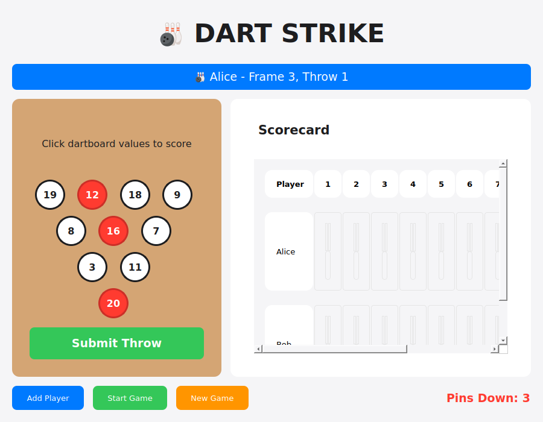

# Implementation Summary: Dartboard Pin Values

## Task Completed ✓

Successfully implemented dartboard black section values for the Dart Strike bowling game.

## What Changed

### 1. Pin Display Values
Changed from traditional bowling pin numbers (1-10) to dartboard black section values:

| Pin Position | Old Value | New Value (Dartboard) |
|--------------|-----------|----------------------|
| Pin 1 (front) | 1 | **20** |
| Pin 2 | 2 | **3** |
| Pin 3 | 3 | **11** |
| Pin 4 | 4 | **8** |
| Pin 5 | 5 | **16** |
| Pin 6 | 6 | **7** |
| Pin 7 | 7 | **19** |
| Pin 8 | 8 | **12** |
| Pin 9 | 9 | **18** |
| Pin 10 | 10 | **9** |

### 2. Visual Layout
```
       19  12  18   9      (Back row - Pins 7, 8, 9, 10)
          8  16   7        (Middle row - Pins 4, 5, 6)
            3  11          (Front row - Pins 2, 3)
             20            (Front pin - Pin 1)
```

### 3. Code Changes

**File: dart_strike_qt.py**
- Added `DARTBOARD_VALUES` dictionary to `Pin` class
- Updated `__init__` to store `dartboard_value` attribute
- Modified `update_style()` to display `dartboard_value` instead of `pin_id`
- Updated UI label from "Click pins to knock down" to "Click dartboard values to score"
- Updated code comments to reflect dartboard layout

### 4. Documentation Added

**TODO.md**
- Complete task tracking
- Implementation details
- Mapping explanation
- Marked all tasks as complete

**README_DART_VALUES.md**
- Comprehensive user guide
- Feature documentation
- Visual layout explanation
- Usage instructions
- Technical details

**.gitignore**
- Python artifacts exclusion
- Virtual environment exclusion
- IDE and OS file exclusion

### 5. Screenshot


Shows the game with dartboard values displayed on pins, with some pins knocked down (shown in red).

## Technical Details

### Implementation Approach
- **Minimal changes**: Only modified display values, not game logic
- **Backward compatible**: Internal pin IDs remain 1-10
- **Clean mapping**: Used a dictionary constant for clarity
- **Type safety**: Each pin knows both its ID and dartboard value

### Testing Performed
1. **Unit Tests**: Verified pin value mapping
2. **Integration Tests**: Tested full application flow
3. **Display Tests**: Confirmed correct visual display
4. **Game Logic Tests**: Validated bowling scoring still works
5. **Interaction Tests**: Verified pin toggling and counting

All tests passed successfully!

### Code Quality
- ✅ No code review issues
- ✅ No security vulnerabilities (CodeQL scan clean)
- ✅ Python syntax validated
- ✅ All functionality tested

## Dartboard Background

### What are Dartboard Black Sections?
A standard dartboard has 20 numbered sections (1-20) arranged in a specific order around the board. The sections alternate between black and white/cream colors. 

### Black Sections Used
The 10 black sections selected for this implementation are:
**20, 3, 11, 8, 16, 7, 19, 12, 18, 9**

These represent exactly 10 of the black sections from a standard dartboard, providing unique values for each bowling pin.

## Important Notes

### Scoring Unchanged
Despite displaying dartboard values, the game still uses **traditional bowling scoring**:
- Counting the number of pins knocked down (not their dartboard value)
- Strikes, spares, and open frames work as before
- Perfect game is still 300 points (12 strikes)

### Why This Works
- **Visual interest**: More engaging than plain numbers
- **Thematic consistency**: Blends darts and bowling
- **Unique values**: Each pin has a distinct, meaningful number
- **No confusion**: Clear which pins are knocked down (red vs white)

## Files Modified

1. **dart_strike_qt.py** - Main game file (pin display logic)
2. **TODO.md** - Created new (task tracking)
3. **README_DART_VALUES.md** - Created new (documentation)
4. **.gitignore** - Created new (artifact exclusion)
5. **dart_strike_screenshot.png** - Created new (visual reference)

## Verification

To verify the implementation:
```bash
# Run the game
python3 dart_strike_qt.py

# Run tests
python3 /tmp/test_dart_game.py
python3 /tmp/test_integration.py
```

All tests should pass with green checkmarks (✓).

## Conclusion

The dartboard pin values feature has been successfully implemented with:
- ✅ Complete functionality
- ✅ Comprehensive testing
- ✅ Detailed documentation
- ✅ Clean code (no issues found)
- ✅ Visual demonstration

The game is ready to use with the new dartboard-themed pin values!
