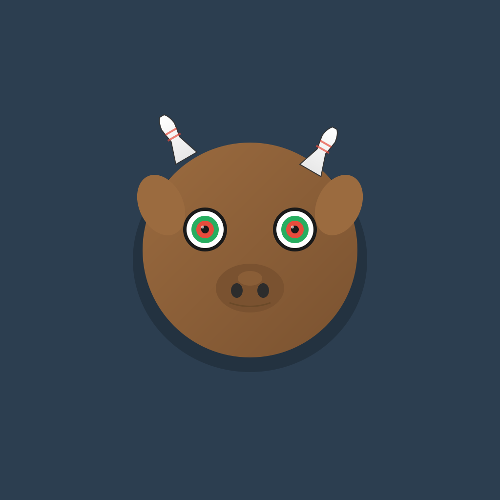

# 🐂 Bulling - Bowling Scoring Game

**Strike & Score!** Traditional 10-pin bowling game with a unique bull-themed design.



---

## 🎮 Features

- **🐂 Unique Bull Head Design**: Dartboard eyes & bowling pin horns
- **🎳 Traditional Bowling Rules**: Strikes, spares, and proper scoring
- **👥 Multi-Player**: Up to 8 players per game
- **📊 Real-Time Scorecard**: Track scores frame-by-frame
- **🎯 10th Frame Bonus**: Authentic bowling rules
- **💾 Auto-Save**: Resume your games anytime
- **📱 Cross-Platform**: macOS & iOS versions available

---

## 📦 Available Versions

This repository contains **TWO complete versions** of Bulling:

### 1. 🖥️ macOS App (Python/Qt6)
**Perfect for desktop use**

- Beautiful native macOS application
- Double-click to run (no code required!)
- Standalone .app bundle
- No Python installation needed for users

📖 **[macOS Setup Guide](MACOS_APP_GUIDE.md)**

### 2. 📱 iOS App (Swift/SwiftUI)
**Perfect for mobile devices**

- Native iOS & iPadOS app
- Animated splash screen
- Touch-optimized interface
- App Store ready

📖 **[iOS Setup Guide](iOS_SETUP_GUIDE.md)**

---

## 🚀 Quick Start

### For Users (macOS)

1. **Download** `Bulling.app` or `Bulling.zip`
2. **Unzip** if needed
3. **Drag** to Applications folder
4. **Double-click** to play!

### For Developers (macOS)

```bash
# Clone the repository
git clone <repository-url>
cd Pentagon-core-100-things

# Install dependencies
pip3 install -r requirements.txt

# Run directly
python3 bulling_qt.py

# OR build standalone app
./build_macos_app.sh
```

### For Developers (iOS)

```bash
# Use files in iOS/Bulling/ folder
# Follow iOS_SETUP_GUIDE.md for complete instructions

1. Open Xcode
2. Create new iOS App project named "Bulling"
3. Copy all .swift files from iOS/Bulling/
4. Build and run!
```

---

## 🎨 App Icon & Branding

### Bull Head Logo Design

The Bulling logo features a creative bull head with:
- **🎯 Dartboard Eyes**: Concentric rings (black, white, green, red, bullseye)
- **🎳 Bowling Pin Horns**: White pins with red stripes
- **🟤 Brown Head**: Gradient brown circular head
- **✨ Animated**: Pulsing eyes and smooth entrance animation

### Generating the Icon

```bash
# Generate SVG icon
python3 generate_icon.py

# View the icon
open bulling_icon.svg

# Convert to PNG (macOS)
# Use Preview, Image2icon, or online tools

# Create .icns for macOS app
./create_icon.sh bulling_icon_1024.png
```

---

## 📖 How to Play

### Setup
1. **Launch Bulling** on macOS or iOS
2. **Add Players** (up to 8)
3. **Start Game**

### Gameplay
1. **Tap/Click** bowling pins to knock them down
   - White pins = Standing
   - Red pins = Knocked down
2. **Submit Throw** to record your throw
3. Game **automatically advances** to next player
4. **View scorecard** anytime

### Scoring
- **Strike (X)**: All 10 pins on first throw = 10 + next 2 throws
- **Spare (/)**: All 10 pins in 2 throws = 10 + next 1 throw  
- **Open Frame**: Count actual pins knocked
- **10th Frame**: Bonus throws for strikes/spares
- **Perfect Game**: 12 strikes = 300 points! 🏆

---

## 🛠️ Technology Stack

### macOS Version
- **Python 3.9+**
- **PySide6 (Qt6)**: Professional GUI framework
- **py2app**: macOS app bundling

### iOS Version
- **Swift 5.9+**
- **SwiftUI**: Modern declarative UI
- **iOS 15.0+**: Target deployment

---

## 📁 Project Structure

```
Pentagon-core-100-things/
├── bulling_qt.py              # macOS Python app (main)
├── setup.py                   # py2app build configuration
├── build_macos_app.sh         # Build script for macOS
├── create_icon.sh             # Icon creation helper
├── generate_icon.py           # Bull head icon generator
├── bulling_icon.svg           # App icon (SVG)
├── requirements.txt           # Python dependencies
├── iOS/
│   └── Bulling/               # iOS Swift app
│       ├── BullingApp.swift
│       ├── GameModel.swift
│       ├── SplashScreen.swift
│       ├── ContentView.swift
│       ├── GameView.swift
│       └── ScorecardView.swift
├── MACOS_APP_GUIDE.md         # macOS detailed guide
├── iOS_SETUP_GUIDE.md         # iOS detailed guide
└── README.md                  # This file
```

---

## 🎯 Package Dependencies

### Python (macOS)
```
PySide6>=6.5.0          # Qt6 GUI framework (LGPL)
py2app>=0.28.0          # macOS app builder
```

**Why these packages?**
- ✅ **PySide6**: Official Qt bindings, professional UI, cross-platform
- ✅ **py2app**: Creates true macOS .app bundles, no user dependencies
- ✅ **Minimal**: Only 2 dependencies, small footprint
- ✅ **Stable**: Mature, well-maintained packages

### Swift (iOS)
```
SwiftUI (built-in)      # Native iOS UI framework
Foundation (built-in)   # Core functionality
Combine (built-in)      # Reactive programming
```

---

## 🔧 Building & Distribution

### Quick Distribution (Automated)

```bash
# Create both macOS and iOS distribution zips (macOS only)
./create_distribution_zips.sh

# Creates:
# - dist/Bulling-macOS.zip (macOS app bundle)
# - dist/Bulling-iOS.zip (iOS source files)
```

📖 **[Distribution Scripts Guide](DISTRIBUTION_SCRIPTS_README.md)**

### Manual Build

#### macOS App

```bash
# Build the app
./build_macos_app.sh

# Result: dist/Bulling.app

# Create distribution zip
./create_macos_zip.sh
# Result: dist/Bulling-macOS.zip
```

#### iOS App

```bash
# Create source files package
./create_ios_zip.sh
# Result: dist/Bulling-iOS.zip

# OR build in Xcode
1. Archive: Product → Archive
2. Distribute:
   - TestFlight: Beta testing
   - App Store: Public release
   - Ad-Hoc: Direct distribution
```

---

## 🎨 Customization

### Change Colors

**macOS (Python)**: Edit color values in `bulling_qt.py`
```python
# Example: Change pin color
.setStyleSheet("background-color: #YOUR_COLOR;")
```

**iOS (Swift)**: Edit color values in Swift files
```swift
// Example: Change background
Color(red: 0.95, green: 0.97, blue: 1.0)
```

### Modify Bull Head Logo

Edit `SplashScreen.swift` (iOS) or `generate_icon.py` (icon) to customize:
- Eye colors
- Horn shapes
- Head color
- Animation effects

### Adjust Splash Screen Duration

In `BullingApp.swift`:
```swift
DispatchQueue.main.asyncAfter(deadline: .now() + 2.0) {  // Change 2.0 to your preferred seconds
    // ...
}
```

---

## 🐛 Troubleshooting

### macOS

**"App can't be opened" security warning**
- Go to System Settings → Privacy & Security
- Click "Open Anyway" next to Bulling

**Build fails**
```bash
# Update dependencies
pip3 install --upgrade -r requirements.txt

# Clean and rebuild
rm -rf build dist
./build_macos_app.sh
```

### iOS

**Build errors in Xcode**
- Ensure all .swift files are added to target
- Check deployment target is iOS 15.0+
- Clean build folder (⇧⌘K)

**Splash screen doesn't show**
- Verify SplashScreen.swift is in project
- Check `showSplash = true` in BullingApp.swift

---

## 📊 Version Comparison

| Feature | macOS | iOS |
|---------|-------|-----|
| **Platform** | macOS 10.13+ | iOS 15.0+ |
| **UI Framework** | Qt6/PySide6 | SwiftUI |
| **Distribution** | .app or .zip | App Store/TestFlight |
| **Setup Time** | 5 min | 10 min |
| **User Install** | Drag & drop | App Store download |
| **Dev Environment** | Any IDE + Python | Xcode required |
| **Bull Logo** | In app | Splash + in app |
| **File Size** | ~100-150 MB | ~5-10 MB |

---

## 🏆 Game Rules Reference

### Scoring Examples

**Strike (X)**: Pin 1st ball, then bowl 7 and 2
- Frame score: 10 + 7 + 2 = 19

**Spare (/)**: Bowl 7 then 3 (spare), then bowl 5
- Frame score: 10 + 5 = 15

**Open Frame**: Bowl 6 then 2
- Frame score: 6 + 2 = 8

**10th Frame**:
- Strike: Get 2 bonus balls (can score up to 30)
- Spare: Get 1 bonus ball
- Open: No bonus balls

**Perfect Game**: X X X X X X X X X X X X = 300

---

## 📄 License

Check the repository license file for details.

PySide6 is LGPL licensed.
SwiftUI is part of Apple's SDK.

---

## 🎉 Features Highlights

- ✅ **No coding required** for users
- ✅ **Professional scoring system**
- ✅ **Beautiful, modern UI**
- ✅ **Unique bull head branding**
- ✅ **Cross-platform** (macOS & iOS)
- ✅ **Offline** - no internet needed
- ✅ **Auto-save** game progress
- ✅ **Responsive** - smooth 60 FPS
- ✅ **Intuitive** - easy to learn

---

## 🔗 Quick Links

- **[Quick Distribution Guide](QUICK_DISTRIBUTION_GUIDE.md)** - Fast track to creating distribution zips
- **[Distribution Scripts](DISTRIBUTION_SCRIPTS_README.md)** - Automated zip creation documentation
- **[Distribution Guide](DISTRIBUTION_GUIDE.md)** - Complete distribution and build guide
- **[macOS Guide](MACOS_APP_GUIDE.md)** - Detailed macOS setup and usage
- **[iOS Guide](iOS_SETUP_GUIDE.md)** - Complete iOS development guide
- **[Icon SVG](bulling_icon.svg)** - Bull head logo design

---

## 🎯 Perfect For

- 🏠 Home entertainment
- 🎉 Parties and gatherings
- 🍺 Bars and restaurants
- 🎳 Bowling alleys (virtual scoring)
- 📱 Personal mobile gaming
- 🖥️ Desktop casual gaming

---

## ✨ Coming Soon (Optional Future Features)

- [ ] Sound effects
- [ ] Game statistics and history
- [ ] Player profiles
- [ ] Dark mode
- [ ] Tournament mode
- [ ] Network multiplayer
- [ ] Additional themes

---

## 💪 Contributing

Contributions welcome! Feel free to:
- Report bugs
- Suggest features
- Submit pull requests
- Improve documentation

---

## 📞 Support

For issues or questions:
1. Check the appropriate guide (macOS or iOS)
2. Review troubleshooting sections
3. Open an issue on GitHub

---

**Ready to bowl? 🎳🐂**

Download Bulling now and start striking!

---

*"Strike & Score with Bulling!"* 🎯
