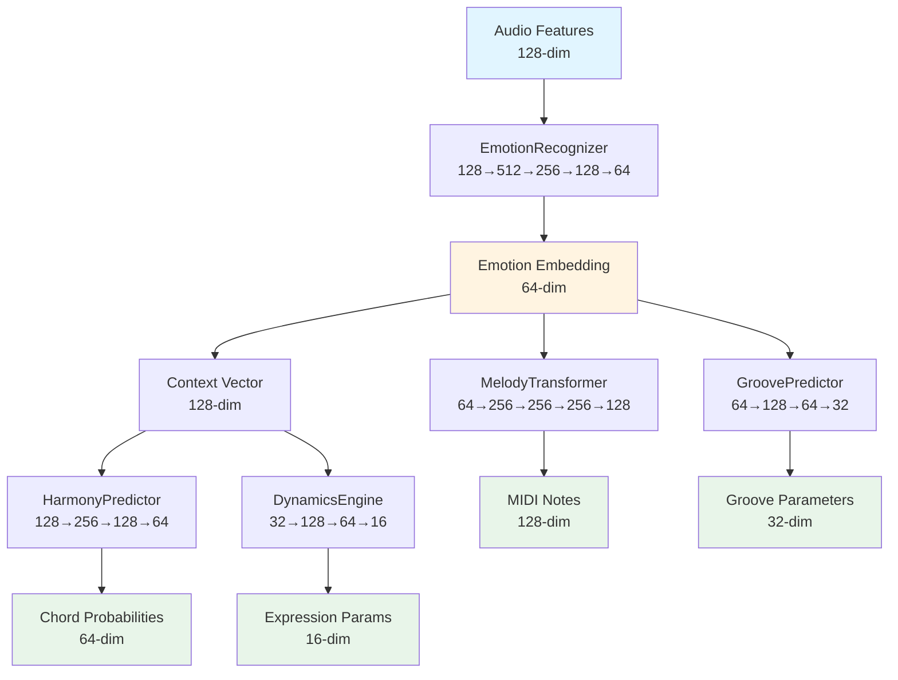

# ML Architecture Documentation

## Overview

The Kelly MIDI Companion uses a 5-model neural network architecture for real-time music generation. The system processes audio features through a sequential pipeline to generate emotion-aware MIDI, harmony, dynamics, and groove parameters.

**Total Specifications:**

- **Parameters**: ~1,152,280 total (403,264 + 641,664 + 74,176 + 13,520 + 18,656)
- **Memory**: ~4.6 MB (float32)
- **Inference Target**: <10ms per model
- **Real-time Safety**: Non-blocking, lock-free communication

## Architecture Overview

The system consists of 5 specialized models that work together in a sequential pipeline:

1. **EmotionRecognizer**: Audio → Emotion (128→64)
2. **MelodyTransformer**: Emotion → MIDI (64→128)
3. **HarmonyPredictor**: Context → Chords (128→64)
4. **DynamicsEngine**: Context → Expression (32→16)
5. **GroovePredictor**: Emotion → Groove (64→32)

## Data Flow



## Model Specifications

### 1. EmotionRecognizer

**Purpose**: Extract emotion embedding from audio mel-spectrogram features.

**Architecture**:

- Input: 128-dim mel-spectrogram features
- Output: 64-dim emotion embedding (valence/arousal space)
- Layers:
  - FC(128→512) + Tanh
  - FC(512→256) + Tanh
  - LSTM(256→128)
  - FC(128→64) + Tanh

**Specifications** (from [`src/ml/MultiModelProcessor.h`](src/ml/MultiModelProcessor.h:50-56)):

- Input Size: 128
- Output Size: 64
- Estimated Parameters: 403,264
- Memory: ~1.5 MB

**Implementation**: [`ml_training/train_all_models.py`](ml_training/train_all_models.py:48-67)

**Dataset**: DEAM (Dataset for Emotion Analysis in Music)

### 2. MelodyTransformer

**Purpose**: Generate MIDI note probabilities from emotion embedding.

**Architecture**:

- Input: 64-dim emotion embedding
- Output: 128-dim MIDI note probabilities
- Layers:
  - FC(64→256) + ReLU
  - LSTM(256→256)
  - FC(256→256) + ReLU
  - FC(256→128) + Sigmoid

**Specifications**:

- Input Size: 64
- Output Size: 128
- Estimated Parameters: 641,664
- Memory: ~2.4 MB

**Implementation**: [`ml_training/train_all_models.py`](ml_training/train_all_models.py:70-90)

**Dataset**: Lakh MIDI Dataset

### 3. HarmonyPredictor

**Purpose**: Predict chord probabilities from context (emotion + state).

**Architecture**:

- Input: 128-dim context vector
- Output: 64-dim chord probabilities
- Layers:
  - FC(128→256) + Tanh
  - FC(256→128) + Tanh
  - FC(128→64) + Softmax

**Specifications**:

- Input Size: 128
- Output Size: 64
- Estimated Parameters: 74,176
- Memory: ~0.3 MB

**Implementation**: [`ml_training/train_all_models.py`](ml_training/train_all_models.py:93-108)

**Dataset**: Chord progression databases

### 4. DynamicsEngine

**Purpose**: Generate expression parameters (velocity/timing) from compact context.

**Architecture**:

- Input: 32-dim compact context
- Output: 16-dim expression parameters
- Layers:
  - FC(32→128) + ReLU
  - FC(128→64) + ReLU
  - FC(64→16) + Sigmoid

**Specifications**:

- Input Size: 32
- Output Size: 16
- Estimated Parameters: 13,520
- Memory: ~0.05 MB

**Implementation**: [`ml_training/train_all_models.py`](ml_training/train_all_models.py:111-127)

**Dataset**: MAESTRO (MIDI and Audio Edited for Synchronous TRacks and Organization)

### 5. GroovePredictor

**Purpose**: Predict groove parameters (timing/velocity patterns) from emotion.

**Architecture**:

- Input: 64-dim emotion embedding
- Output: 32-dim groove parameters
- Layers:
  - FC(64→128) + Tanh
  - FC(128→64) + Tanh
  - FC(64→32) + Tanh

**Specifications**:

- Input Size: 64
- Output Size: 32
- Estimated Parameters: 18,656
- Memory: ~0.07 MB

**Implementation**: [`ml_training/train_all_models.py`](ml_training/train_all_models.py:130-145)

**Dataset**: Groove MIDI Dataset

## RTNeural Integration

### Export Format

Models are exported from PyTorch to RTNeural JSON format for C++ inference. The export function is in [`ml_training/train_all_models.py`](ml_training/train_all_models.py:164-350).

**JSON Structure**:

```json
{
  "layers": [
    {
      "type": "dense",
      "in_size": 128,
      "out_size": 512,
      "activation": "tanh",
      "weights": [[...], [...]],
      "bias": [...]
    },
    {
      "type": "lstm",
      "in_size": 256,
      "out_size": 128,
      "weights_ih": [[...], [...], [...], [...]],
      "weights_hh": [[...], [...], [...], [...]],
      "bias_ih": [[...], [...], [...], [...]],
      "bias_hh": [[...], [...], [...], [...]]
    }
  ],
  "metadata": {
    "model_name": "EmotionRecognizer",
    "framework": "PyTorch",
    "export_version": "2.0",
    "parameter_count": 403264,
    "memory_bytes": 1613056,
    "input_size": 128,
    "output_size": 64
  }
}
```

### LSTM Weight Splitting

PyTorch LSTM weights are stored as:

- `weight_ih`: Shape `[4*hidden_size, input_size]` (4 gates: input, forget, cell, output)
- `weight_hh`: Shape `[4*hidden_size, hidden_size]`

RTNeural expects weights split into 4 separate gate arrays. The export function splits these correctly:

- Gate 0: Input gate
- Gate 1: Forget gate
- Gate 2: Cell gate
- Gate 3: Output gate

See [`ml_training/train_all_models.py`](ml_training/train_all_models.py:152-161) for the splitting implementation.

### C++ Loading

Models are loaded in C++ using RTNeural's JSON parser:

```cpp
// From src/ml/MultiModelProcessor.cpp
auto model = RTNeural::json_parser::parseJson<float>(jsonStream);
model->reset();  // Important for LSTM layers
```

The C++ implementation is in [`src/ml/MultiModelProcessor.cpp`](src/ml/MultiModelProcessor.cpp:17-77).

### Fallback Mode

If models fail to load, the system uses heuristic-based fallback inference:

- EmotionRecognizer: Returns neutral emotion embedding
- MelodyTransformer: Returns uniform note probabilities
- HarmonyPredictor: Returns C major chord
- DynamicsEngine: Returns default velocity/timing
- GroovePredictor: Returns neutral groove parameters

## Performance Targets

### Inference Latency

- **Target**: <10ms per model
- **Total Pipeline**: <50ms for all 5 models
- **Real-time Safety**: Non-blocking, async inference for audio thread

### Memory Footprint

- **Total Parameters**: ~1,152,280
- **Memory (float32)**: ~4.6 MB
- **Target**: <5MB (current: 4.6MB)

### Real-time Safety

- Models run on separate thread (not audio thread)
- Lock-free communication via atomic flags
- AsyncMLPipeline handles non-blocking inference
- See [`src/ml/MultiModelProcessor.h`](src/ml/MultiModelProcessor.h:137-163) for async implementation

## Training Pipeline

### Dataset Support

1. **DEAM**: Emotion recognition (audio + valence/arousal labels)
2. **Lakh MIDI**: Melody generation (MIDI files + emotion labels)
3. **MAESTRO**: Dynamics/expression (MIDI with velocity data)
4. **Groove MIDI**: Groove patterns (drum MIDI files)
5. **Chord Progressions**: Harmony prediction (JSON chord databases)

Dataset loaders are in [`ml_training/dataset_loaders.py`](ml_training/dataset_loaders.py).

### Training Script

The unified training script is [`ml_training/train_all_models.py`](ml_training/train_all_models.py).

**Features**:

- Supports all 5 models
- Real dataset support with synthetic fallback
- Early stopping, checkpointing, metrics tracking
- RTNeural JSON export
- Training curve plotting

**Usage**:

```bash
python ml_training/train_all_models.py \
    --output ./trained_models \
    --datasets-dir ./datasets \
    --epochs 50 \
    --batch-size 64 \
    --device cuda
```

### Training Utilities

Consolidated training utilities are in [`ml_training/training_utils.py`](ml_training/training_utils.py):

- **TrainingMetrics**: Track training/validation metrics with plotting
- **EarlyStopping**: Prevent overfitting
- **CheckpointManager**: Save/load checkpoints with automatic cleanup
- **LearningRateScheduler**: Multiple LR scheduling strategies
- **evaluate_model()**: Model evaluation on datasets
- **calculate_accuracy()**: Accuracy calculation for different task types

## Model Validation

Exported models should be validated to ensure they match C++ specifications. Use the validation script:

```bash
python ml_training/validate_models.py ./trained_models
```

The validation script checks:

- JSON structure validity
- Input/output sizes match C++ `ModelSpec`
- Parameter counts match expected values
- Layer structure (dense/LSTM) is correct
- LSTM weights are split into 4 gates
- RTNeural compatibility

See [`ml_training/validate_models.py`](ml_training/validate_models.py) for implementation.

## Troubleshooting

### Model Loading Failures

**Issue**: Models fail to load in C++

- **Check**: JSON file is valid and parseable
- **Check**: LSTM weights are split into 4 gates correctly
- **Check**: Layer types match RTNeural supported types
- **Check**: Activation functions are valid

### Parameter Count Mismatches

**Issue**: Parameter count doesn't match C++ specification

- **Check**: Model architecture matches exactly (layer sizes)
- **Check**: Bias terms are included in count
- **Check**: LSTM parameters are counted correctly

### Inference Latency Issues

**Issue**: Inference takes >10ms

- **Check**: Model is running on correct device (CPU/GPU)
- **Check**: RTNeural is compiled with optimizations
- **Check**: Batch size is 1 for real-time inference
- **Check**: No unnecessary memory allocations

### Memory Issues

**Issue**: Memory usage >4MB

- **Check**: Models are using float32 (not float64)
- **Check**: No duplicate model instances
- **Check**: Checkpoint cleanup is working

## References

- **C++ Implementation**: [`src/ml/MultiModelProcessor.h`](src/ml/MultiModelProcessor.h), [`src/ml/MultiModelProcessor.cpp`](src/ml/MultiModelProcessor.cpp)
- **Python Training**: [`ml_training/train_all_models.py`](ml_training/train_all_models.py)
- **Dataset Loaders**: [`ml_training/dataset_loaders.py`](ml_training/dataset_loaders.py)
- **Training Utilities**: [`ml_training/training_utils.py`](ml_training/training_utils.py)
- **Model Validation**: [`ml_training/validate_models.py`](ml_training/validate_models.py)
- **RTNeural**: <https://github.com/jatinchowdhury18/RTNeural>
